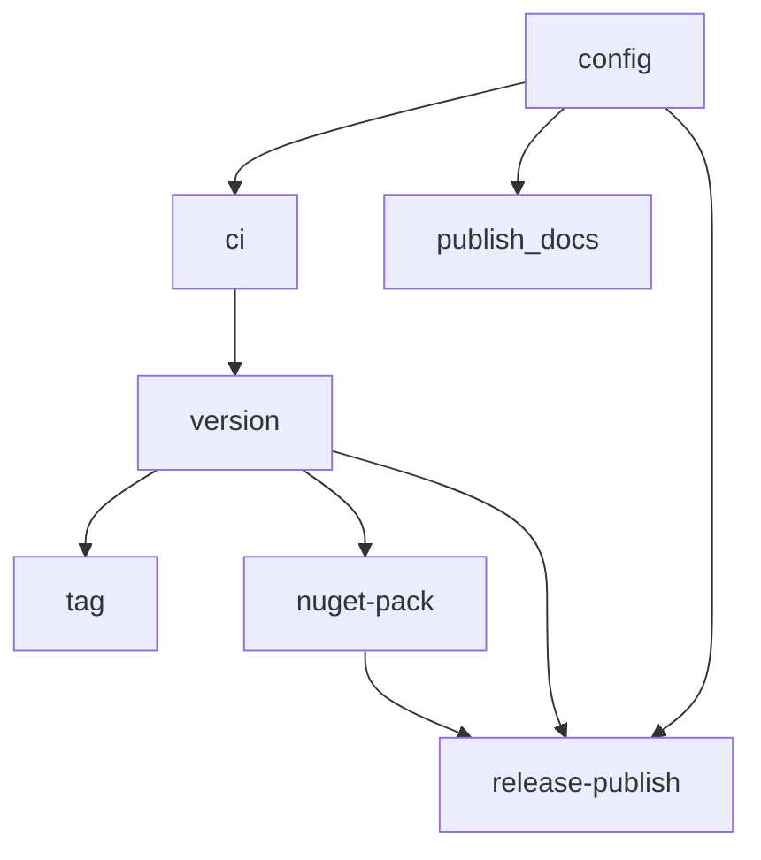

# GitHub Actions Workflow Structure

This project uses GitHub Actions for comprehensive CI/CD automation. The workflows are designed for maintainability, reusability, and best practices.

## Workflow Architecture

### Main Orchestrator Workflows

- **`ci.yml`**: Continuous Integration pipeline
  - Triggered on push/PR to main branches
  - Runs security audit, build, and test workflows
  - Configurable test skipping for faster iteration

- **`cd.yml`**: Continuous Deployment pipeline
  - Triggered on push to release branches and tags
  - Orchestrates the complete release process
  - Creates semantic versions, NuGet packages, and GitHub releases

### Reusable Workflow Components

``` txt
.github/workflows/
├── ci.yml                    # Main CI orchestrator
├── cd.yml                    # Main CD orchestrator
├── config-values.yml         # Centralized configuration
├── version.yml              # Semantic versioning with GitVersion
├── build.yml                # Solution build
├── test.yml                 # Test execution with coverage
├── security-audit.yml       # Security and vulnerability scanning
├── nuget-pack.yml          # NuGet package creation
├── tag.yml                 # Git tag creation
├── publish-docs.yml        # Documentation publishing
└── release-publish.yml     # GitHub release creation
```

### Composite Actions

- **`.github/actions/setup-dotnet/`**: Standardized .NET SDK setup
  - Configurable .NET version
  - Consistent environment across all jobs

## Configuration Management

### Centralized Configuration (`config-values.yml`)

All tool versions and feature flags are centralized:

```yaml
# Tool Versions
dotnet_version: "8.0.x"
node_version: "20"

# Feature Flags
run_tests: true
run_security_audit: true
run_pack: true
run_docs: true
run_release: true
include_test_results_in_release: true
```

### Key Features

1. **Reusable Workflows**: All jobs use `workflow_call` for maximum reusability
2. **Centralized Config**: Single source of truth for versions and feature flags
3. **Artifact Management**: Efficient artifact sharing between jobs
4. **Error Handling**: Comprehensive error handling and debugging
5. **Security**: Proper permissions and secret management

## Workflow Dependencies



## Key Improvements

### 1. Semantic Versioning

- Uses GitVersion for automatic semantic versioning
- Proper workflow-level outputs for version sharing
- Supports different branching strategies

### 2. Artifact Management

- Standardized artifact naming (`build-outputs`, `nuget-packages`, `test-results`)
- Efficient artifact reuse between jobs
- Proper retention policies

### 3. Enhanced Release Process

- Modern release creation with `softprops/action-gh-release@v2`
- Automatic NuGet package attachment
- Rich release notes with test results and package information
- GitHub Pages documentation deployment

### 4. Test Integration

- Comprehensive test execution with code coverage
- Test result publishing with `dorny/test-reporter`
- Optional test result inclusion in releases
- Graceful error handling

## How to Use

### Running Individual Workflows

All workflows support `workflow_dispatch` for manual execution:

```yaml
on:
  workflow_call: # For reusable workflows
  workflow_dispatch: # For manual execution
```

### Configuring the Pipeline

1. **Tool Versions**: Update `config-values.yml`
2. **Feature Flags**: Toggle individual jobs in `config-values.yml`
3. **Branch Strategy**: Configure GitVersion in `GitVersion.yml`

### Adding New Jobs

1. Create a reusable workflow with `workflow_call` trigger
2. Add configuration options to `config-values.yml` if needed
3. Reference from orchestrator workflows (`ci.yml` or `cd.yml`)

## Best Practices Applied

- ✅ Reusable workflow components
- ✅ Centralized configuration management
- ✅ Proper dependency chains
- ✅ Artifact lifecycle management
- ✅ Security-first permissions
- ✅ Comprehensive error handling
- ✅ Modern GitHub Actions features

## Troubleshooting

### Common Issues

1. **Missing Artifacts**: Check dependency chain and artifact names
2. **Permission Errors**: Verify workflow permissions in caller workflows
3. **Version Issues**: Ensure GitVersion configuration matches branch strategy

### Debug Mode

Enable step debugging by adding to any workflow:

```yaml
- name: Debug Information
  run: |
    echo "Debug info here"
```

---

For specific workflow details, see the individual workflow files and their inline documentation.
